# Guia de Street View com Insta360 X4

Este guia padroniza a coleta, o processamento e a georreferenciação de imagens 360° feitas com a Insta360 X4 para uso no Street View.

> **Resultado esperado:** uma sequência de imagens equiretangulares `MULTICAPTURA_*.jpg`, com coordenadas GPS gravadas, pronta para validação e publicação no QGIS com o plugin Ferramentas_EBGEO.

## Visão geral do fluxo

1. Escolha o método de coleta: vídeo ou disparo intervalado.
2. Garanta a telemetria GPS durante a coleta.
3. Exporte as imagens pelo Insta360 Studio.
4. Quando necessário, extraia os frames e associe-os à trilha GPX com o script do projeto.
5. Valide e publique no QGIS.

## Escolha do método

| Método | Quando usar | Vantagem | Atenção |
| --- | --- | --- | --- |
| **Vídeo 360°** | Levantamentos que exigem continuidade e maior confiabilidade. | Menor risco de falhas de posicionamento. | Exige exportação, extração de frames e correção de telemetria. |
| **Disparo intervalado** | Percursos lentos, especialmente dentro de quartéis. | Processo mais simples: gera fotos individuais. | Mantenha a viatura entre **10 e 20 km/h** e fotografe a cada 3 s para evitar lacunas. |

## GPS e telemetria

A Insta360 X4 não possui GPS integrado. Escolha uma das formas abaixo para registrar a localização.

### Opção A - GPS do celular

Mantenha o aplicativo Insta360 aberto e em primeiro plano durante toda a coleta. Desative o modo de economia de energia do celular; caso contrário, a gravação da rota pode ser interrompida.

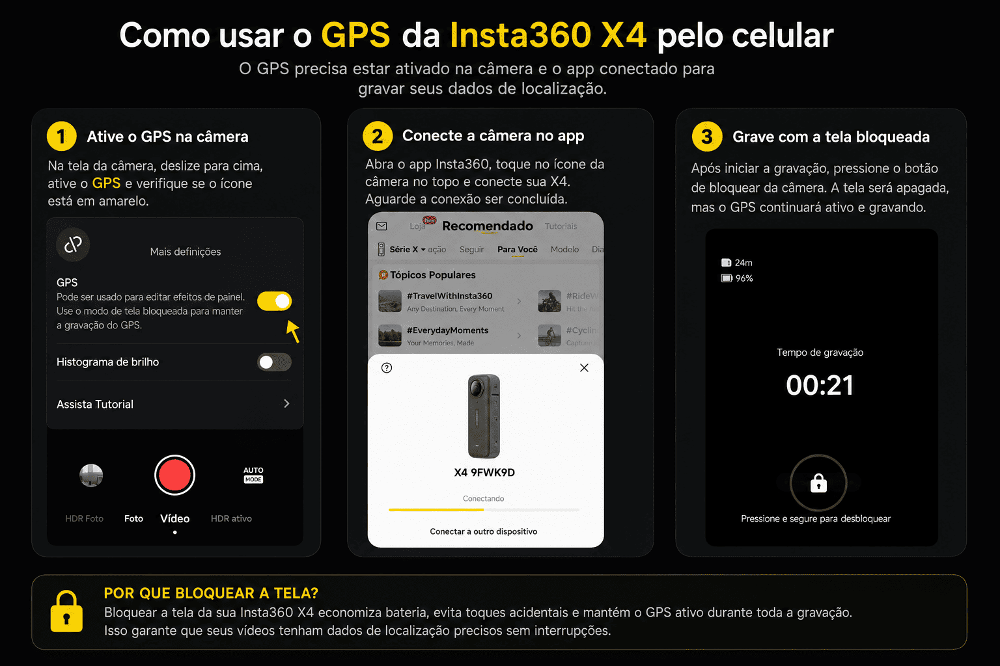

### Opção B - GPS externo (Garmin ou equivalente)

Grave a rota em um arquivo `.gpx`. Antes de processar, confira se o fuso horário do GPS e o das imagens estão alinhados: o script usa os horários para cruzar a rota e cada fotografia.

### Opção C - controle remoto Bluetooth com GPS

Esta é a alternativa recomendada quando se deseja independência do celular. O controle remoto injeta a posição nas imagens durante a coleta.

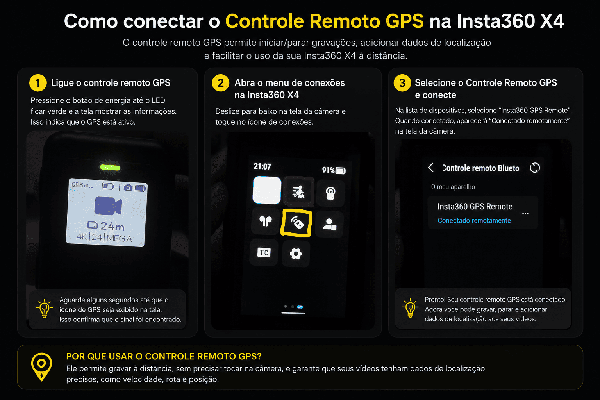

## 1. Coleta no modo Vídeo 360°

Use este método quando a continuidade do mapeamento for prioridade.

### Configure a câmera

- **Modo:** vídeo 360°;
- **Resolução:** 4K;
- **Taxa de quadros:** 24 FPS;
- **FlowState:** ativado.

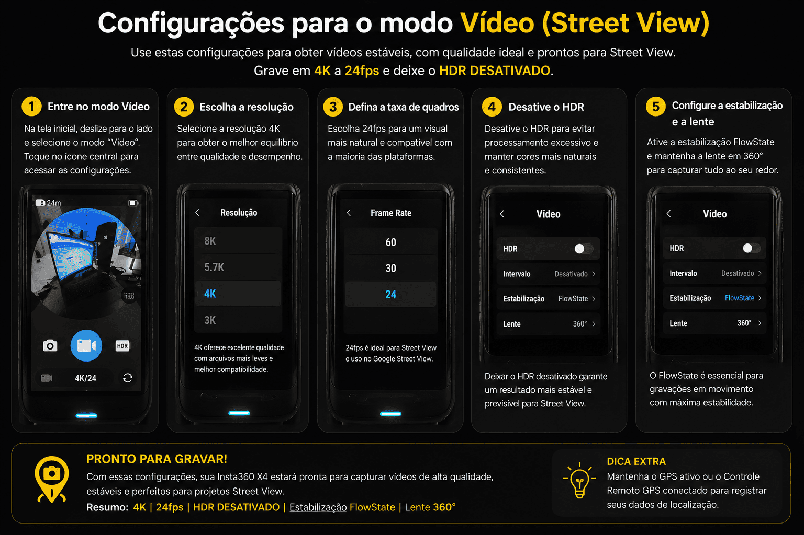

Essa combinação mantém a qualidade necessária para Street View sem criar arquivos excessivamente grandes, o que acelera a cópia para o computador e o processamento.

## 2. Coleta no modo Disparo intervalado

Use este método quando for possível deslocar-se lentamente e com velocidade constante.

### Configure a câmera

- **Resolução:** 18 MP;
- **Taxa de quadros:** 24 FPS;
- **Intervalo:** 3 s;
- **Velocidade da viatura:** entre **10 e 20 km/h**.

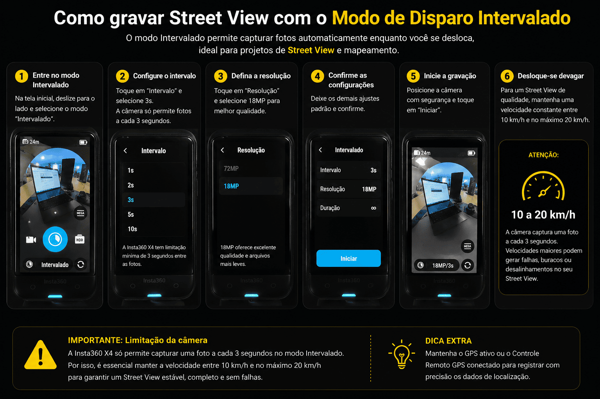

## Preparação do computador

Instale estes requisitos antes de iniciar o processamento:

- [Python](https://www.python.org/downloads/);
- [FFmpeg](https://www.gyan.dev/ffmpeg/builds/packages/ffmpeg-8.1.1-essentials_build.zip?utm_source=chatgpt.com);
- [ExifTool](https://sitsa.dl.sourceforge.net/project/exiftool/exiftool-13.58_64.zip?viasf=1&fid=ee431851bb782df9);
- [Insta360 Studio](https://www.insta360.com/download/insta360-x4).

### Python

Durante a instalação, marque **Add python.exe to PATH**. Em seguida, abra o Prompt de Comando e confirme a instalação:

```bat
python --version
```

Instale as bibliotecas usadas pelos scripts:

```bat
pip install gpxpy pillow piexif
```

| Biblioteca | Função |
| --- | --- |
| `gpxpy` | Lê arquivos GPX. |
| `pillow` | Abre e salva imagens JPG. |
| `piexif` | Grava metadados EXIF e GPS. |

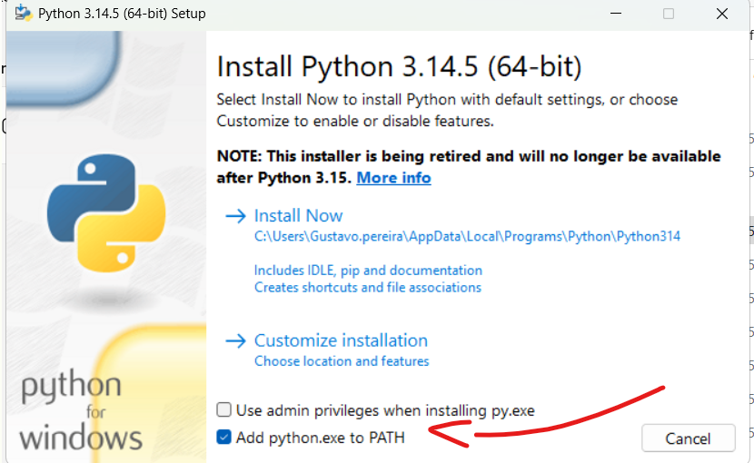

### FFmpeg

1. Baixe e extraia o FFmpeg.
2. Coloque a pasta em `C:\`.
3. Adicione a subpasta `bin` às variáveis de ambiente `PATH`.
4. Confirme no Prompt de Comando:

```bat
ffmpeg -version
```

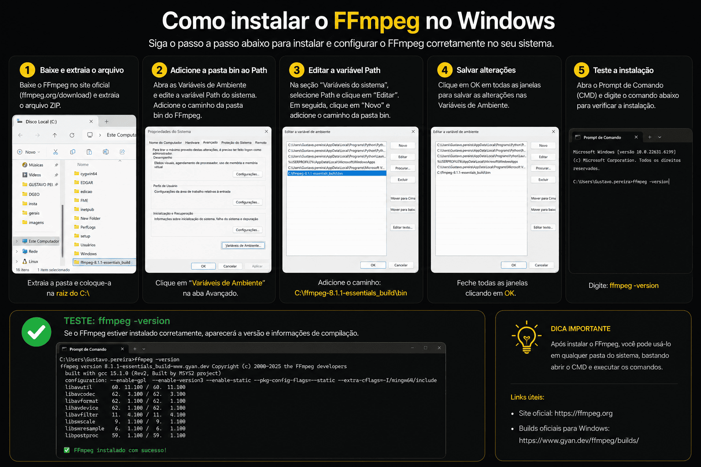

### ExifTool

Baixe e extraia o ExifTool. A instalação segue a mesma lógica do FFmpeg: renomeie o executável conforme orientado no pacote, mantenha-o em local conhecido e garanta que o comando seja acessível. Uma cópia de `exiftool.exe` também deverá ficar na pasta de cada projeto.

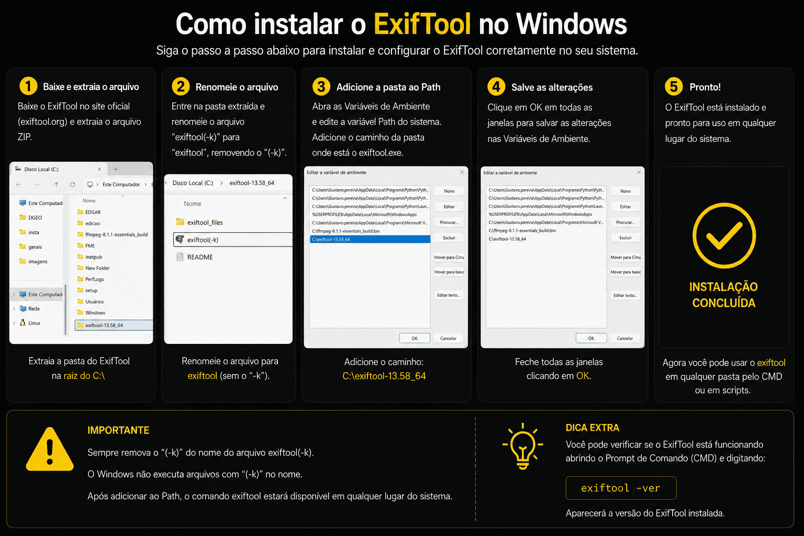

## Processamento do modo Vídeo

### 1. Exporte no Insta360 Studio

Abra o vídeo no Insta360 Studio e exporte com estes parâmetros:

- **Tipo:** Vídeo 360°;
- **Resolução:** `5760 × 2880`;
- **Codec:** H.264;
- **Bitrate:** 12 Mbps;
- **FPS:** 24;
- **Exportar GPX:** ativado;
- **Formato:** 360° equiretangular.

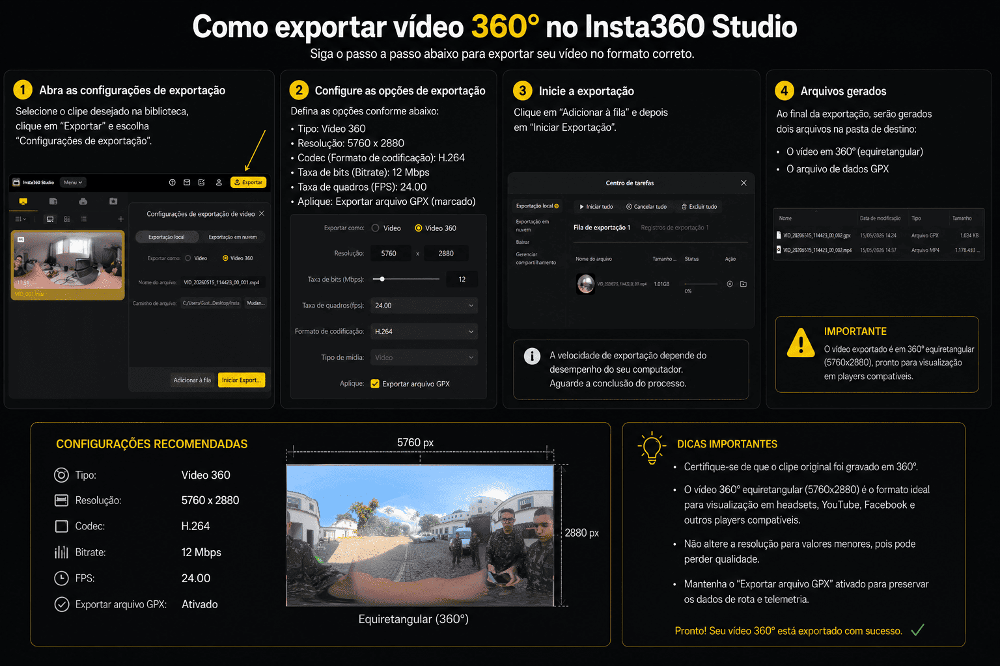

### 2. Monte a pasta do projeto

Baixe a estrutura-base do projeto (conforme o material original) ou crie a seguinte estrutura:

```text
Projeto/
├── video.mp4                 # vídeo exportado pelo Studio
├── rota.gpx                  # trilha GPX exportada pelo Studio
├── modelo.jpg                 # arquivo-modelo de metadados
├── exiftool.exe               # executável do ExifTool
├── pipeline.py                # script que associa GPX aos frames
├── frames/                    # frames extraídos do vídeo
└── frames_processados/        # frames finais, com coordenadas
```

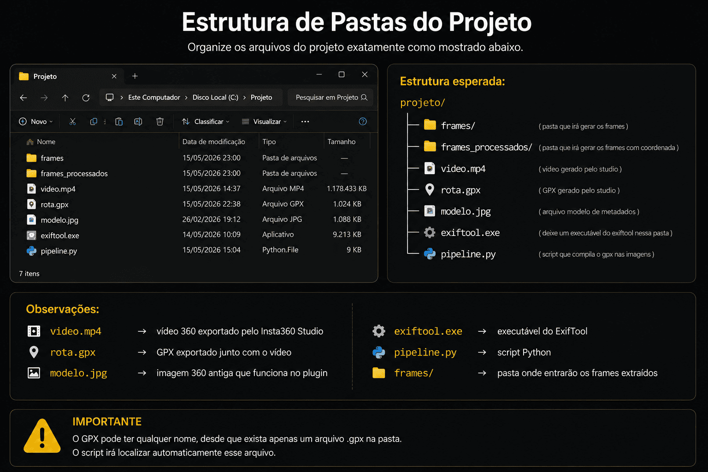

### 3. Extraia os frames com FFmpeg

Abra o Prompt de Comando dentro da pasta do projeto:

```bat
cd C:\Projeto
```

Escolha o intervalo de acordo com a operação e mantenha o mesmo valor no arquivo `pipeline.py`.

| Intervalo | Comando FFmpeg | Configuração no script |
| --- | --- | --- |
| 1 imagem/s | `ffmpeg -i video.mp4 -vf fps=1 -q:v 1 frames\frame_%06d.jpg` | `FRAME_INTERVAL_SECONDS = 1` |
| 1 imagem/2 s | `ffmpeg -i video.mp4 -vf fps=0.5 -q:v 1 frames\frame_%06d.jpg` | `FRAME_INTERVAL_SECONDS = 2` |
| 1 imagem/3 s | `ffmpeg -i video.mp4 -vf fps=0.3333 -q:v 1 frames\frame_%06d.jpg` | `FRAME_INTERVAL_SECONDS = 3` |

**Referência operacional:** a pé, use 2 a 3 segundos; em viatura, use 2 segundos.

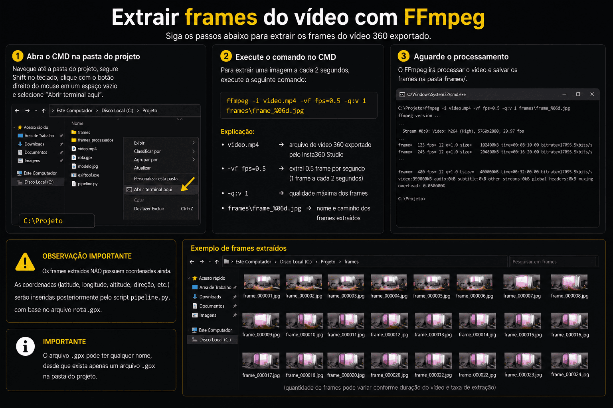

### 4. Associe os frames à rota GPX

Ainda dentro da pasta do projeto, execute:

```bat
python pipeline.py
```

Os arquivos finais serão gravados em `frames_processados/`, por exemplo:

```text
MULTICAPTURA_0000_000001.jpg
MULTICAPTURA_0000_000002.jpg
MULTICAPTURA_0000_000003.jpg
```

Se já houver imagens em `frames_processados/`, o script continua a numeração automaticamente. Exemplo: após o índice `553`, a próxima imagem será `MULTICAPTURA_0000_000554.jpg`.

> **Verificação essencial:** confirme que `FRAME_INTERVAL_SECONDS` no script é exatamente o mesmo intervalo usado no FFmpeg.

## Processamento do modo Disparo intervalado

Este método gera fotos individuais, portanto é mais direto. O ponto crítico é a telemetria.

### Quando usar GPS do controle remoto

As fotos já saem da câmera com coordenadas. O fluxo é:

1. Importe a pasta de fotos no Insta360 Studio.
2. Mantenha o formato 360°/equiretangular completo.
3. Exporte diretamente para a pasta `frames` do projeto.
4. No terminal aberto na pasta do projeto, execute:

```bat
python pipeline2fotodireto.py
```

O script lê as coordenadas existentes, adapta a estrutura dos metadados ao padrão aceito pelo plugin do mapa e gera o resultado pronto para envio. Nesta situação, não é necessário um arquivo GPX externo.

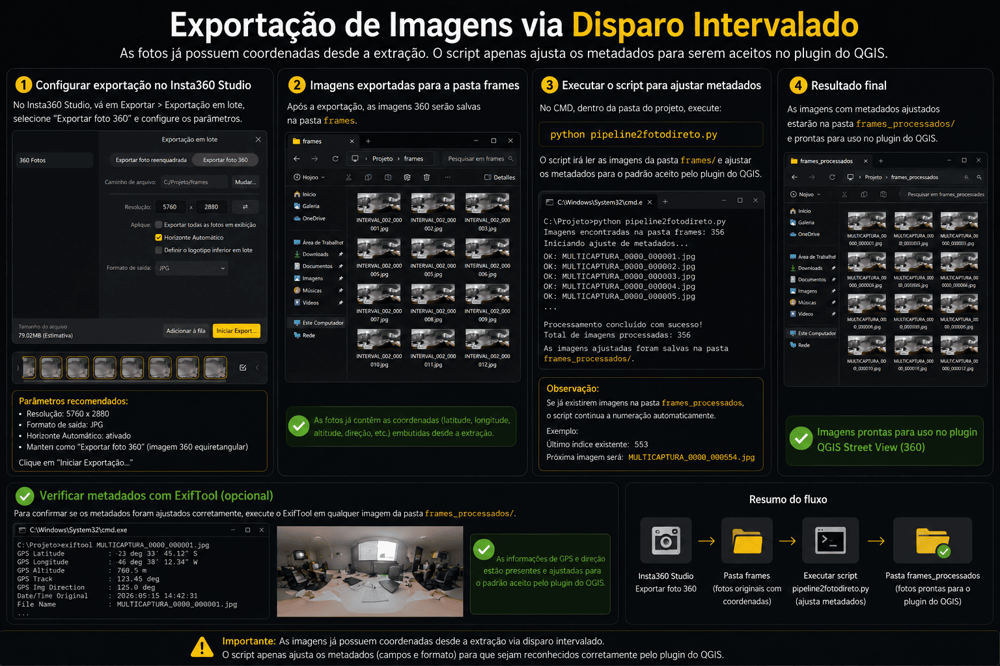

### Quando usar GPS externo (Garmin ou similar)

1. Copie o arquivo `.gpx` para a pasta do projeto.
2. Copie as fotos para a pasta `frames/`.
3. Execute:

```bat
python pipeline.py
```

O script cruza o horário de cada foto com a linha do tempo do GPS, interpola a posição e grava a coordenada aproximada nos metadados de cada imagem.

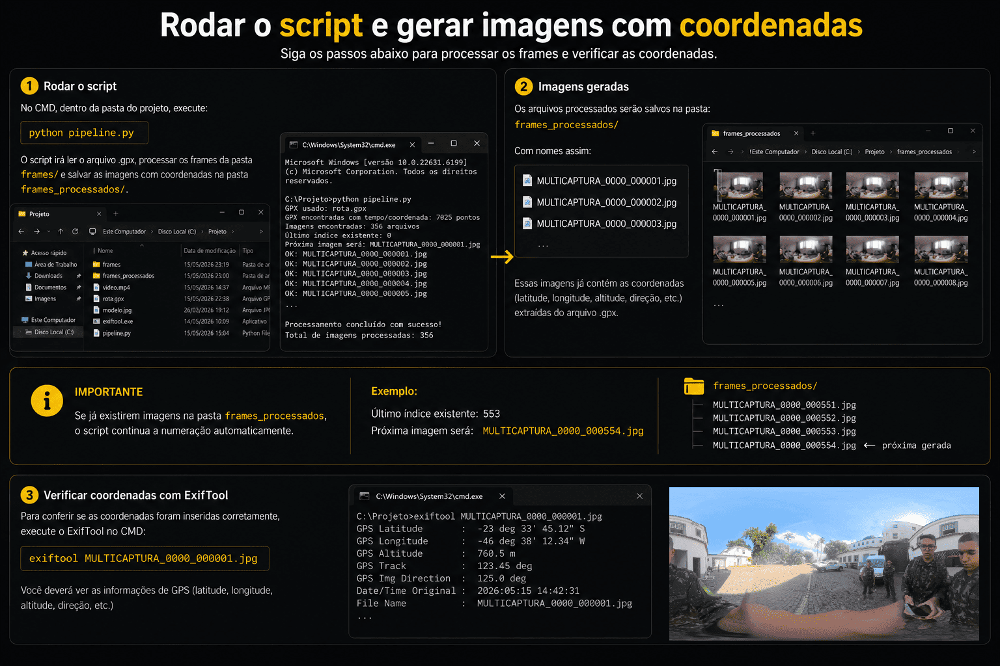

## Checklist antes da publicação

- [ ] As imagens estão em formato equiretangular 360°.
- [ ] O GPS foi gravado pelo celular, controle remoto ou arquivo GPX.
- [ ] Fuso horário de câmera e GPS estão compatíveis, se houver GPX externo.
- [ ] O intervalo configurado no FFmpeg é igual a `FRAME_INTERVAL_SECONDS`.
- [ ] As imagens finais estão em `frames_processados/` e possuem coordenadas.
- [ ] A sequência foi validada no QGIS com o plugin Ferramentas_EBGEO.

## Próxima etapa

Com as imagens `MULTICAPTURA_*.jpg` equiretangulares e georreferenciadas, prossiga com a validação e a publicação no QGIS pelo plugin Ferramentas_EBGEO.
